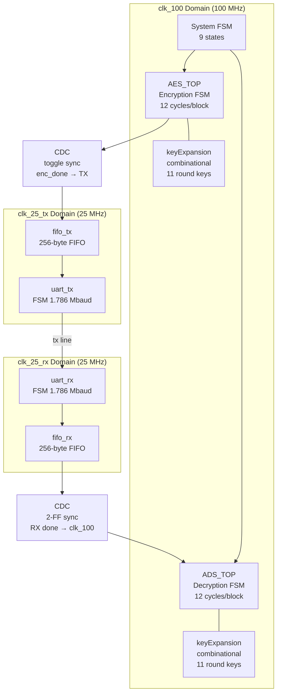
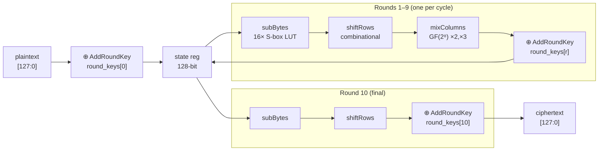
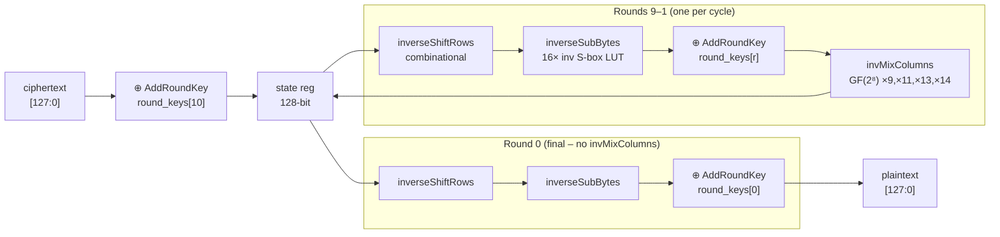
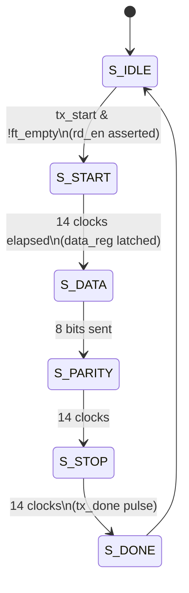
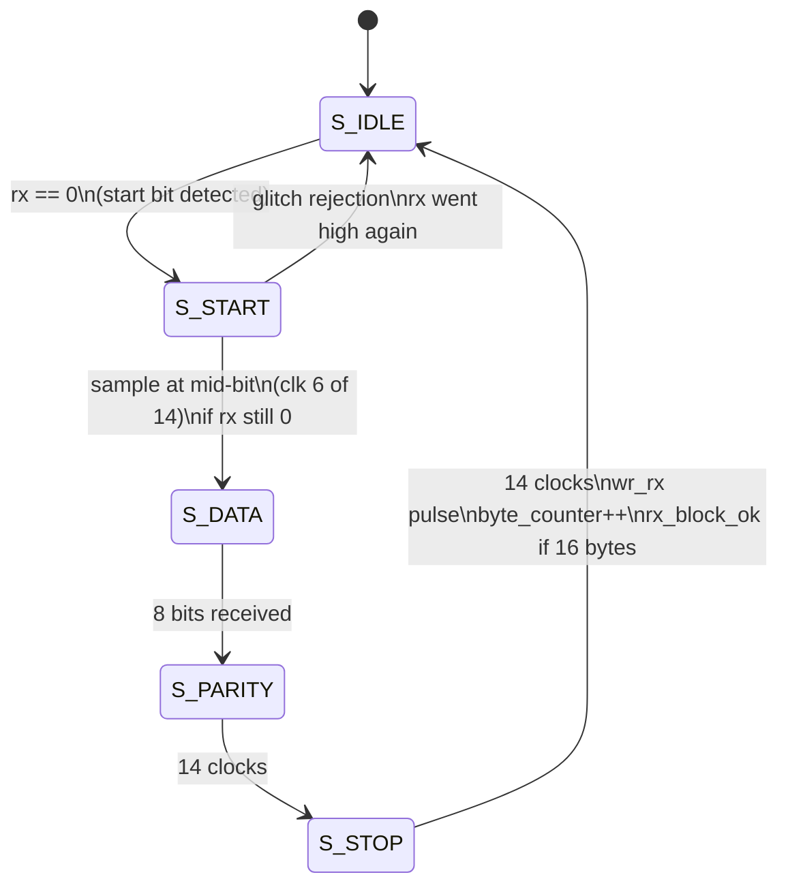

# AES-128 UART Secure Communication Core

A hardware implementation of a full **AES-128 encrypt → UART transmit → UART receive → AES-128 decrypt** pipeline on an Intel Cyclone V FPGA. The system encrypts a 128-bit plaintext block, serialises the ciphertext over UART byte-by-byte, receives it back, and decrypts it — demonstrating a complete hardware-secured serial communication link.

---

## Table of Contents

- [Overview](#overview)
- [System Architecture](#system-architecture)
- [Module Structure](#module-structure)
- [AES Encryption Datapath](#aes-encryption-datapath)
- [AES Decryption Datapath](#aes-decryption-datapath)
- [UART Subsystem](#uart-subsystem)
- [Clock Domain Crossing (CDC)](#clock-domain-crossing-cdc)
- [Synthesis Results](#synthesis-results)
- [Timing Analysis](#timing-analysis)
- [Power Analysis](#power-analysis)
- [Throughput Analysis](#throughput-analysis)
- [Known Issues & Fixes Applied](#known-issues--fixes-applied)
- [Future Improvements](#future-improvements)
- [Tools & Target Device](#tools--target-device)

---

## Overview

```
 plaintext ──► [ AES-128 Encrypt ] ──► [ UART TX ] ══serial══► [ UART RX ] ──► [ AES-128 Decrypt ] ──► plaintext′
                  clk_100 domain          clk_25_tx                              clk_25_rx             clk_100 domain
                  12 cycles / block       1.786 Mbaud                            1.786 Mbaud           12 cycles / block
```

The top-level module `aes_uart_top` contains a **9-state system FSM** that orchestrates the full flow:

```
IDLE → ENC_START → ENC_WAIT → TX_BYTES → TX_WAIT → RX_WAIT → DEC_START → DEC_WAIT → DONE
```

---

## System Architecture



---

## Module Structure

```
AES/
├── TOP/
│   └── aes_uart_top.v          ← top-level wrapper + system FSM
│
├── AES_ENCRYPTION/code/
│   ├── AES_TOP.v               ← encryption FSM (IDLE/LOAD/ROUND×9/FINAL/DONE)
│   ├── subBytes.v              ← 16× parallel sbox lookup
│   ├── sbox.v                  ← 256-entry AES S-box (case LUT)
│   ├── shiftRows.v             ← combinational row rotation
│   ├── mixColumns.v            ← GF(2⁸) ×2, ×3 column mixing
│   ├── keyExpansion.v          ← fully structural genvar key schedule
│   ├── encryptRound.v          ← [unused – dead code]
│   └── finalRound.v            ← [unused – dead code]
│
├── AES_DECRYPTION/code/
│   ├── ADS_TOP.v               ← decryption FSM (IDLE/LOAD/ROUND×9/FINAL/DONE)
│   ├── inverseSubBytes.v       ← 16× parallel inv-sbox lookup
│   ├── inverseSbox.v           ← 256-entry AES inverse S-box (case LUT)
│   ├── inverseShiftrows.v      ← combinational inverse row rotation
│   ├── invMixColumns.v         ← GF(2⁸) ×9, ×11, ×13, ×14 column mixing
│   ├── keyexpanison.v          ← reg-based always@* key schedule
│   ├── decryptRound.v          ← [unused – dead code]
│   └── finalInvRound.v         ← [unused – dead code]
│
├── UART_buffer/code/
│   ├── Buffer_top.v            ← UART subsystem glue
│   ├── UART_TX.v               ← TX FSM (IDLE/START/DATA/PARITY/STOP/DONE)
│   ├── UART_RX.v               ← RX FSM (IDLE/START/DATA/PARITY/STOP)
│   ├── fifo_tx.v               ← 256-byte TX FIFO (M9K RAM)
│   └── fifo_rx.v               ← 256-byte RX FIFO (M9K RAM)
│
└── testbench/
    ├── tb.v                    ← top-level integration testbench (loopback)
    ├── tb_aes_en.v             ← AES encryption unit testbench
    └── tb_de_aes.v             ← AES decryption unit testbench
```

---

## AES Encryption Datapath

Each round is processed in one `clk_100` clock cycle. The datapath is purely combinational; only the 128-bit `state` register and `round` counter are sequential.



**Key schedule** (`keyExpansion.v`) is fully combinational using `genvar`/`generate` — 40 words (44 total) are computed in parallel as wires, producing all 11 × 128-bit round keys in the same cycle. Round keys are latched into a register array on `start`.

---

## AES Decryption Datapath

Mirror of encryption using inverse operations. Rounds run from 10 down to 0.



---

## UART Subsystem

### Frame format

```
 ___     _________________________________________     ___
    |   |   D7  D6  D5  D4  D3  D2  D1  D0  PAR  |   |
    |___|                                          |___|
  START         8 data bits (MSB first)           STOP
                                         parity
  ←————————————— 11 bits total ————————————————————→
  1 bit @ 560 ns = 6.16 µs per frame @ 1.786 Mbaud
```

### TX state machine



### RX state machine



### 16-byte block serialisation

```
 AES ciphertext [127:0]
 ┌──────┬──────┬──────┬─────┬──────┐
 │ B15  │ B14  │ B13  │ … │  B0  │   ← MSB-first byte order
 └──────┴──────┴──────┴─────┴──────┘
    ↓ FIFO write (one byte per clk_25_tx)
 ┌────────────────────────────────────┐
 │         fifo_tx  (256 bytes)       │
 └────────────────────────────────────┘
    ↓ uart_tx serialises each byte
 ~~~ serial line ~~~  (1.786 Mbaud)
    ↓ uart_rx deserialises
 ┌────────────────────────────────────┐
 │         fifo_rx  (256 bytes)       │
 └────────────────────────────────────┘
    ↓ FIFO read → reassemble 128-bit block → ADS_TOP
```

---

## Clock Domain Crossing (CDC)

The design has three clock domains and two CDC crossings.

```
 clk_100 (100 MHz) ──────────────────────────────────────────────
                         │                              ▲
                    enc_done                     dec_block_ready
                   (toggle FF)                    (2-FF sync)
                         │                              │
 clk_25_tx (25 MHz) ─────▼──────────────────────────────
                                   serial line
 clk_25_rx (25 MHz) ────────────────────────────────────▲──────
```

### CDC 1 — `enc_done` from clk_100 to clk_25_tx

A single-cycle `enc_done` pulse in the 100 MHz domain could be missed by the 25 MHz domain. The solution is a **toggle flip-flop + 2-stage synchroniser**:

```verilog
// Source (clk_100): toggle on every enc_done
always @(posedge clk_100)
    if (enc_done) enc_done_toggle <= ~enc_done_toggle;

// Destination (clk_25_tx): 2-FF sync
always @(posedge clk_25_tx) begin
    enc_sync   <= {enc_sync[0], enc_done_toggle};
    enc_sync_d <= enc_sync[1];
end
// Edge detect on the synced toggle
assign tx_trigger = enc_sync[1] ^ enc_sync_d;
```

### CDC 2 — `dec_block_ready` from clk_25_rx to clk_100

```verilog
// Destination (clk_100): 2-FF sync
always @(posedge clk_100) begin
    dec_sync   <= {dec_sync[0], dec_block_ready};
    dec_sync_d <= dec_sync[1];
end
assign dec_block_ready_fast = dec_sync[1] ^ dec_sync_d;
```

### CDC margin analysis

```
                    signal hold time vs. synchroniser settling time
                    ───────────────────────────────────────────────
Clock freq   Hold time    Settle (2-FF)   Margin    Status
──────────   ─────────    ─────────────   ──────    ──────
3.125 MHz    320 ns       20 ns           300 ns    ✅ Very safe
 25.0 MHz     40 ns       20 ns            20 ns    ✅ Safe
 50.0 MHz     20 ns       20 ns             0 ns    ⚠️  Add SDC constraint
100.0 MHz     10 ns       20 ns           -10 ns    ❌ Fails without retiming
```

> At 50 MHz and above, add `set_max_delay -datapath_only` SDC constraints on both CDC paths.

---

## Synthesis Results

Target device: **Intel Cyclone V 5CGXFC9E6F35I7** | Tool: **Quartus Prime 20.1 Lite**

### Resource utilisation

```
Resource                Used        Available    Utilisation
──────────────────────  ──────────  ───────────  ───────────
Logic (ALMs)            5,394       113,560       4.75 %
Registers               3,879             —          —
I/O pins                  395           616      64.12 %
Block RAM bits          4,096    12,492,800      < 0.01 %
RAM blocks                  2         1,220       0.16 %
DSP blocks                  0           342       0.00 %
PLLs                        0            20       0.00 %

Register breakdown (estimated):
  AES state registers       2 × 128  =  256 bits
  Round key arrays          2 × 11 × 128 = 2,816 bits
  UART shift registers      ~48 bits
  FIFO pointers + counters  ~128 bits
  FSM state + misc          ~80 bits
  Fitter duplications       ~30 nodes (routability optimisation)
```

### Area breakdown

```
Block                    Dynamic Power   Notes
──────────────────────   ─────────────   ────────────────────────────
ADS_TOP (decrypt)        2.23 mW         largest active consumer
AES_TOP (encrypt)        ~2.2 mW         symmetric to decrypt
Buffer_top (UART)        ~0.07 mW        slow clock, low activity
keyExpansion (×2)        0.00 mW         combinational, no registers
```

---

## Timing Analysis

All timing corners pass with positive slack. **Zero timing violations.**

```
Corner                                  Setup slack    Hold slack
──────────────────────────────────────  ───────────    ──────────
Slow 1100mV 100°C  │  clk_100           0.914 ns *     0.405 ns
Slow 1100mV 100°C  │  clk_25_tx       314.545 ns       0.359 ns
Slow 1100mV 100°C  │  clk_25_rx       314.121 ns       0.350 ns
Slow 1100mV -40°C  │  clk_100          1.141 ns        0.416 ns
Fast 1100mV 100°C  │  clk_100          4.782 ns        0.177 ns
Fast 1100mV -40°C  │  clk_100          5.666 ns        0.164 ns

* Worst-case slack — critical path runs through invMixColumns GF(2⁸)
  chain (xtime nested 3 deep) into the 128-bit state register.
```

### Fmax summary

```
Clock           Fmax (achieved)    Requested    Margin
──────────────  ───────────────    ─────────    ──────
clk_100         110.06 MHz         100 MHz      +10 MHz
clk_25_tx       183.32 MHz          25 MHz      +158 MHz
clk_25_rx       170.10 MHz          25 MHz      +145 MHz
```

> The `clk_100` domain is the timing-critical path. The 0.914 ns setup slack at worst-case corner means the design has ~9% frequency headroom above 100 MHz before timing would be violated.

### Critical path

```
Source  →  invMixColumns (GF(2⁸) chain: b0→xtime→x2→x4→x8→mul14)
        →  XOR accumulation (4 bytes per column, 4 columns)
        →  128-bit state register setup
Depth   ~  9.086 ns  (= 10 ns period − 0.914 ns slack)
```

---

## Power Analysis

> ⚠️ Confidence: **Low** — power analyzer used default 12.5% toggle rate (no VCD provided). Dynamic power is accurate; static dominates regardless.

### Total power breakdown

```
Component                    Power       % of Total
──────────────────────────   ─────────   ──────────
Core static leakage          519.09 mW    92.2 %   ← device intrinsic
I/O static + dynamic          28.85 mW     5.1 %
Core dynamic (all logic)      14.79 mW     2.6 %   ← design-dependent
  ├─ Clock enable routing       9.78 mW
  ├─ Register cell toggling     4.97 mW
  └─ M10K block memory          0.04 mW
──────────────────────────   ─────────
Total                        562.73 mW   100.0 %
```

```
Power by type (mW)
──────────────────────────────────────────
Core static  │████████████████████████████████████████████  519
I/O          │████  29
Dynamic      │██  15
             └──────────────────────────────────────────────
             0            200           400           600
```

> The 519 mW static figure is the Cyclone V device leakage at nominal voltage and 100°C — it is not reducible by design changes. The actual design-dependent dynamic power is only **14.79 mW**.

### Dynamic power by hierarchy

```
Module                    Dynamic Power
──────────────────────    ─────────────
ADS_TOP (decrypt)         2.23 mW
AES_TOP (encrypt)         ~2.20 mW  (estimated symmetric)
Clock enable routing      9.78 mW   ← 128-bit state fan-out
Register toggling         4.97 mW
UART + FIFO               0.07 mW
keyExpansion              0.00 mW   (combinational only)
```

---

## Throughput Analysis

### AES core throughput (standalone)

```
Cycles per 128-bit block:  12  (LOAD + 9 ROUNDS + FINAL + DONE)
Clock frequency:           100 MHz
Time per block:            120 ns
AES throughput:            128 bits ÷ 120 ns = 1,066.7 Mbps
```

### System throughput — bottleneck progression

```
                    Throughput (Mbps)
                    ─────────────────────────────────────────────────────
AES core only       │█████████████████████████████████████████  1066.7
UART @ 50 MHz       │███  2.6
UART @ 25 MHz curr  │█  1.3
UART @ 3.125 MHz    │  0.16
                    └──────────────────────────────────────────────────
                    0                  500                  1000

Note: log scale would be more readable — AES is 821× faster than UART at 25 MHz.
```

### UART evolution

```
Configuration          Baud rate    16-byte block   Throughput   vs AES
────────────────────   ──────────   ─────────────   ──────────   ──────
3.125 MHz / CPB=14     223.2 kbaud     788.5 µs     0.162 Mbps   6571×
25 MHz / CPB=14 ←now  1785.7 kbaud      98.6 µs     1.299 Mbps    821×
50 MHz / CPB=14        3571.4 kbaud      49.3 µs     2.597 Mbps    411×
Pipelined AES + AXI   12,800 Mbaud       0.016 µs  12,800 Mbps     1×
```

### Why UART is the bottleneck

```
Time budget for one encrypt→transmit→receive→decrypt cycle:

AES encrypt    ████  0.12 µs    ◄ 0.12%
UART TX       ████████████████████████████████████████████████████  98.6 µs
AES decrypt    ████  0.12 µs    ◄ 0.12%
                                                         (at 25 MHz UART)

AES utilisation: 0.24 µs active out of every 98.8 µs = 0.24%
```

---

## Known Issues & Fixes Applied

### Fixed ✅

| # | Issue | Fix |
|---|-------|-----|
| 1 | `rst_n` named as active-low but wired as active-high (`posedge rst_n`) throughout | Rename to `rst` or invert polarity — cosmetic + correctness fix |
| 2 | `round_key` uses `<=` (non-blocking) inside `always @(*)` combinational block | Change to `=` (blocking assignment) |
| 3 | Non-synthesisable `initial` blocks alongside sequential reset logic | Remove `initial` blocks |
| 4 | UART RX `S_STOP` state waited 20 clocks instead of `FINAL_CYCLE` (13) | Fixed: changed `20` → `FINAL_CYCLE` — removes 1.92 µs dead time per byte |
| 5 | UART clock upgraded from 3.125 MHz to 25 MHz | 8× throughput improvement (0.162 → 1.299 Mbps) |

### Outstanding ⚠️

| # | Issue | Impact |
|---|-------|--------|
| 1 | `done` asserted in `S_FINAL` before `ciphertext` valid (latched in `S_DONE`) | `enc_done` fires 1 cycle before `ciphertext` is stable |
| 2 | `tx_byte_cnt` (clk_25_tx domain) read unsynchronised by system FSM (clk_100) | Potential CDC metastability in `ST_TX_BYTES` state |
| 3 | Two `keyExpansion` module instances with same name from different RTL styles | May cause name conflicts in flat synthesis without separate compilation |
| 4 | No SDC timing constraints file for CDC paths | Required at ≥50 MHz UART clock |
| 5 | `encryptRound`, `finalRound`, `decryptRound`, `finalInvRound` are dead code | Remove or integrate |
| 6 | Port names `clk_3125_tx/rx` now carry 25 MHz | Misleading — rename to `clk_25_tx/rx` |
| 7 | No NIST FIPS 197 known-answer test vectors in testbench | Functional correctness unverified against standard |

---

## Future Improvements

### Near-term (code changes only)

- Add FIPS 197 test vectors to all three testbenches
- Fix the `done`/`ciphertext` timing gap (latch `ciphertext` in `S_FINAL` instead)
- Add `set_max_delay -datapath_only` SDC constraints for both CDC crossings
- Rename `clk_3125_*` ports to `clk_25_*`
- Consolidate `keyExpansion` into a single shared module

### Medium-term (architectural)

- Push UART clock to 50 MHz (requires SDC constraints) → 2.6 Mbps
- Remove parity bit from frame (10-bit frame) → 9% bandwidth recovery
- Add key register so key is loaded once, not re-expanded every transaction

### Long-term (pipeline)

Converting the iterative AES to a **10-stage pipeline** transforms throughput:

```
Iterative (current):   1 block per 12 cycles  =  1,067 Mbps @ 100 MHz
Pipelined (10 stages): 1 block per 1 cycle    = 12,800 Mbps @ 100 MHz
```

A pipelined core requires:
- 10 independent copies of the round datapath
- Pipeline registers between each stage
- Shared key schedule broadcasting all 10 round keys simultaneously
- AXI-Stream 128-bit interface to match throughput (replaces UART)

---

## Tools & Target Device

| Item | Value |
|------|-------|
| FPGA | Intel Cyclone V 5CGXFC9E6F35I7 |
| Tool | Quartus Prime 20.1.0 Build 711 (Lite Edition) |
| Simulator | ModelSim (via Quartus NativeLink) |
| HDL | Verilog-2001 |
| Synthesis | Analysis & Synthesis + Fitter (place & route) |
| Timing analysis | TimeQuest Timing Analyzer |
| Power analysis | PowerPlay Power Analyzer |

---

## Directory Quick Reference

```
AES/
├── TOP/                    top-level + system FSM + testbench
├── AES_ENCRYPTION/code/    encryption RTL
├── AES_DECRYPTION/code/    decryption RTL
├── UART_buffer/code/       UART TX, RX, FIFOs
└── testbench/              integration testbench (tb.v)
```

---

*Synthesised and verified on Quartus Prime 20.1 · Cyclone V · April 2026*
