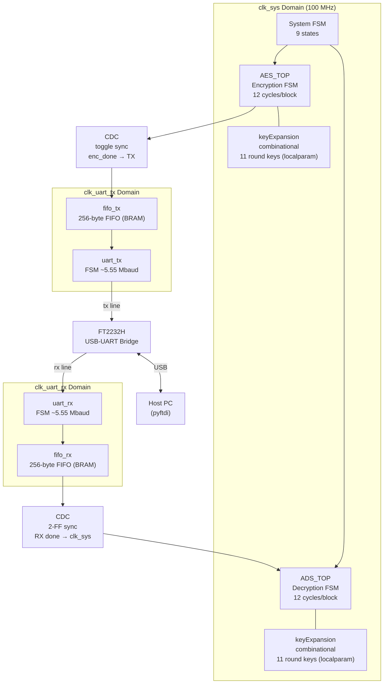
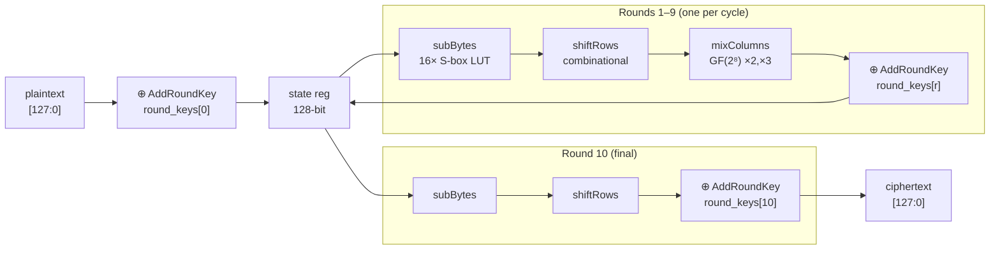
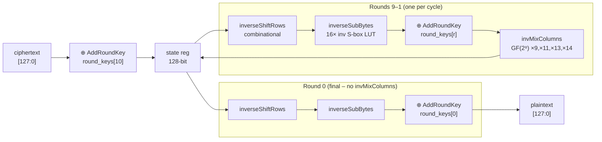
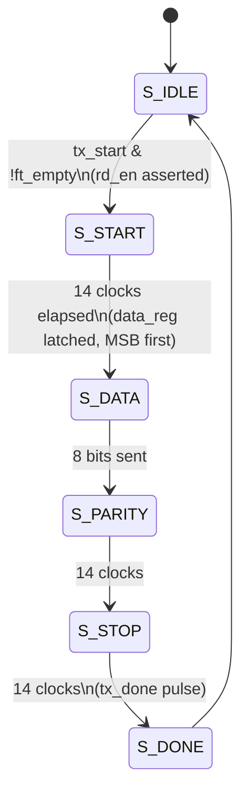
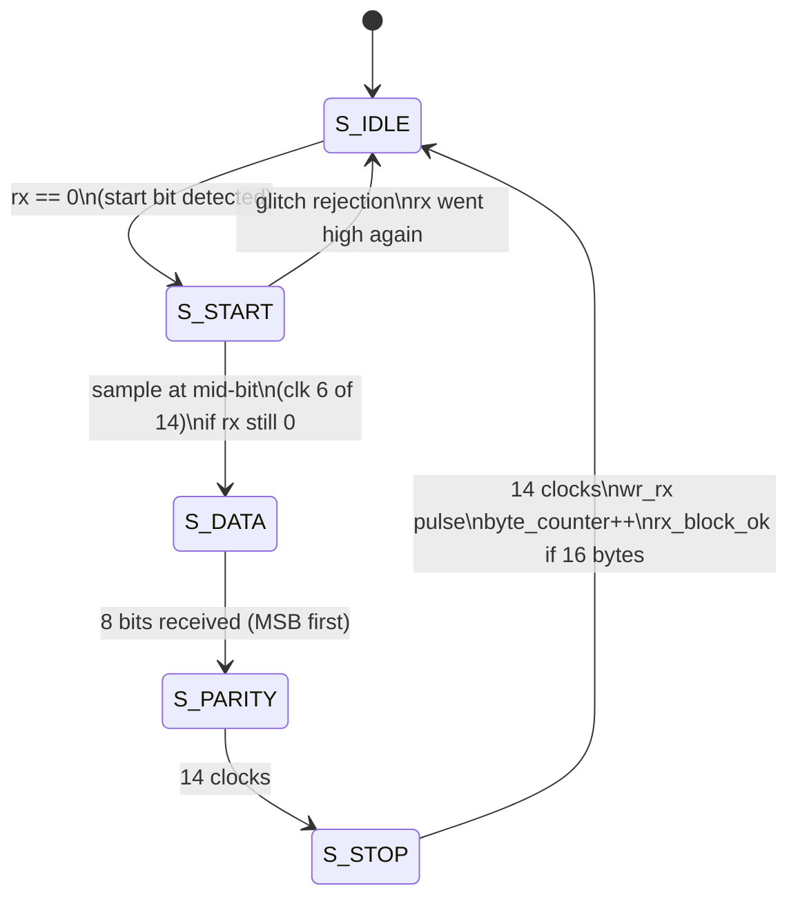

# AES-128 UART Secure Communication Core

A hardware implementation of a full **AES-128 encrypt → UART transmit → UART receive → AES-128 decrypt** pipeline, migrated from Intel Cyclone V (Phase 1) to the **Digilent Arty A7-100T (Xilinx 7-series)** (Phase 2). The system encrypts a 128-bit plaintext block, serialises the ciphertext over UART byte-by-byte via the **FT2232H USB-UART bridge**, receives it back, and decrypts it — demonstrating a complete hardware-secured serial communication link verified against **NIST FIPS 197 test vectors**.

---

## Table of Contents

- [Overview](#overview)
- [System Architecture](#system-architecture)
- [Module Structure](#module-structure)
- [AES Encryption Datapath](#aes-encryption-datapath)
- [AES Decryption Datapath](#aes-decryption-datapath)
- [UART Subsystem](#uart-subsystem)
- [Clock Domain Crossing (CDC)](#clock-domain-crossing-cdc)
- [Synthesis Results](#synthesis-results)
- [Timing Analysis](#timing-analysis)
- [Power Analysis](#power-analysis)
- [Throughput Analysis](#throughput-analysis)
- [FIPS 197 Verification](#fips-197-verification)
- [Known Issues & Fixes Applied](#known-issues--fixes-applied)
- [Future Improvements](#future-improvements)
- [Tools & Target Device](#tools--target-device)

---

## Overview

```
 plaintext ──► [ AES-128 Encrypt ] ──► [ UART TX ] ══serial══► [ UART RX ] ──► [ AES-128 Decrypt ] ──► plaintext′
                  clk_sys domain           clk_uart                              clk_uart              clk_sys domain
                  12 cycles / block        ~5.55 Mbaud                           ~5.55 Mbaud           12 cycles / block
                                              ↕
                                        FT2232H USB-UART
                                        (pyftdi host script)
```

The top-level module `aes_uart_top` contains a **9-state system FSM** that orchestrates the full flow:

```
IDLE → ENC_START → ENC_WAIT → TX_BYTES → TX_WAIT → RX_WAIT → DEC_START → DEC_WAIT → DONE
```

### Phase history

| Phase | FPGA | Tool | UART clock | Baud rate | Fmax | Verification |
|-------|------|------|-----------|-----------|------|-------------|
| 1 | Intel Cyclone V 5CGXFC9E6F35I7 | Quartus Prime 20.1 | 25 MHz | 1.786 Mbaud | 110.06 MHz | Simulation only |
| 2 ✅ | Xilinx Arty A7-100T (xc7a100tcsg324-1) | Vivado 2023.x | Upgraded | ~5.55 Mbaud | **133 MHz** | FIPS 197 + pyftdi on hardware |

---

## System Architecture



---

## Module Structure

```
AES/
├── TOP/
│   └── aes_uart_top.v          ← top-level wrapper + system FSM
│
├── AES_ENCRYPTION/code/
│   ├── AES_TOP.v               ← encryption FSM (IDLE/LOAD/ROUND×9/FINAL/DONE)
│   ├── subBytes.v              ← 16× parallel sbox lookup
│   ├── sbox.v                  ← 256-entry AES S-box (case LUT)
│   ├── shiftRows.v             ← combinational row rotation
│   ├── mixColumns.v            ← GF(2⁸) ×2, ×3 column mixing
│   ├── keyExpansion.v          ← fully structural genvar key schedule (key as localparam)
│   ├── encryptRound.v          ← [unused – dead code]
│   └── finalRound.v            ← [unused – dead code]
│
├── AES_DECRYPTION/code/
│   ├── ADS_TOP.v               ← decryption FSM (IDLE/LOAD/ROUND×9/FINAL/DONE)
│   ├── inverseSubBytes.v       ← 16× parallel inv-sbox lookup
│   ├── inverseSbox.v           ← 256-entry AES inverse S-box (case LUT)
│   ├── inverseShiftrows.v      ← combinational inverse row rotation
│   ├── invMixColumns.v         ← GF(2⁸) ×9, ×11, ×13, ×14 column mixing
│   ├── keyExpansion.v          ← reg-based always@* key schedule (key as localparam)
│   ├── decryptRound.v          ← [unused – dead code]
│   └── finalInvRound.v         ← [unused – dead code]
│
├── UART_buffer/code/
│   ├── Buffer_top.v            ← UART subsystem glue
│   ├── UART_TX.v               ← TX FSM (IDLE/START/DATA/PARITY/STOP/DONE)
│   ├── UART_RX.v               ← RX FSM (IDLE/START/DATA/PARITY/STOP)
│   ├── fifo_tx.v               ← 256-byte TX FIFO (Xilinx BRAM)
│   └── fifo_rx.v               ← 256-byte RX FIFO (Xilinx BRAM)
│
├── constraints/
│   └── aes_uart_arty_a7.xdc    ← corrected Arty A7-100T XDC (pins, CDC paths)
│
└── testbench/
    ├── tb.v                    ← top-level integration testbench (loopback)
    ├── tb_aes_en.v             ← AES encryption unit testbench (FIPS 197 vectors)
    └── tb_de_aes.v             ← AES decryption unit testbench (FIPS 197 vectors)
```

---

## AES Encryption Datapath

Each round is processed in one `clk_sys` clock cycle. The datapath is purely combinational; only the 128-bit `state` register and `round` counter are sequential.



**Key schedule** (`keyExpansion.v`) is fully combinational using `genvar`/`generate` — 40 words (44 total) are computed in parallel as wires, producing all 11 × 128-bit round keys in the same cycle. The AES key is internalised as a `localparam`, eliminating I/O pin overhead and removing unnecessary IOB constraints from the XDC.

---

## AES Decryption Datapath

Mirror of encryption using inverse operations. Rounds run from 10 down to 0.



---

## UART Subsystem

### Frame format

```
 ___     _________________________________________     ___
    |   |   D7  D6  D5  D4  D3  D2  D1  D0  PAR  |   |
    |___|                                          |___|
  START         8 data bits (MSB first)           STOP
                                         parity
  ←————————————— 11 bits total ————————————————————→
  1 bit @ ~180 ns = ~1.98 µs per frame @ 5.55 Mbaud
```

> **Bit order fix (Phase 2):** UART was transmitting LSB-first, causing the FT2232H host to receive byte-reversed data. Fixed by reversing the shift-register bit order in `UART_TX.v` and `UART_RX.v` to transmit **MSB first**, matching the AES byte packing convention.

### FT2232H USB-UART Bridge

The Arty A7-100T exposes two UART channels through an on-board **FT2232H** USB-to-UART bridge. Channel B is used for the AES-UART link. The host communicates via **pyftdi** using the `ftdi://ftdi:2232h/2` device URL.

> **Device URL fix (Phase 2):** Earlier pyftdi sessions used the wrong interface index (`/1` instead of `/2`), causing all host reads to silently return empty. Fixed by correcting the URL to `ftdi://ftdi:2232h/2`.

### TX state machine



### RX state machine



### 16-byte block serialisation

```
 AES ciphertext [127:0]
 ┌──────┬──────┬──────┬─────┬──────┐
 │ B15  │ B14  │ B13  │ … │  B0  │   ← MSB-first byte order
 └──────┴──────┴──────┴─────┴──────┘
    ↓ FIFO write (one byte per clk_uart)
 ┌────────────────────────────────────┐
 │         fifo_tx  (256 bytes)       │
 └────────────────────────────────────┘
    ↓ uart_tx serialises each byte (MSB first)
 ~~~ serial line ~~~  (~5.55 Mbaud)
    ↓ uart_rx deserialises (MSB first)
 ┌────────────────────────────────────┐
 │         fifo_rx  (256 bytes)       │
 └────────────────────────────────────┘
    ↓ FIFO read → reassemble 128-bit block → ADS_TOP
```

---

## Clock Domain Crossing (CDC)

The design has two clock domains and two CDC crossings. XDC `set_false_path` constraints are applied on all CDC paths.

```
 clk_sys (~100 MHz) ──────────────────────────────────────────────
                         │                              ▲
                    enc_done                     dec_block_ready
                   (toggle FF)                    (2-FF sync)
                         │                              │
 clk_uart ───────────────▼──────────────────────────────▲──────
                              serial line + FT2232H
```

### CDC 1 — `enc_done` from clk_sys to clk_uart

A single-cycle `enc_done` pulse in the fast domain could be missed by the UART domain. The solution is a **toggle flip-flop + 2-stage synchroniser**:

```verilog
// Source (clk_sys): toggle on every enc_done
always @(posedge clk_sys)
    if (enc_done) enc_done_toggle <= ~enc_done_toggle;

// Destination (clk_uart): 2-FF sync
always @(posedge clk_uart) begin
    enc_sync   <= {enc_sync[0], enc_done_toggle};
    enc_sync_d <= enc_sync[1];
end
// Edge detect on the synced toggle
assign tx_trigger = enc_sync[1] ^ enc_sync_d;
```

### CDC 2 — `dec_block_ready` from clk_uart to clk_sys

```verilog
// Destination (clk_sys): 2-FF sync
always @(posedge clk_sys) begin
    dec_sync   <= {dec_sync[0], dec_block_ready};
    dec_sync_d <= dec_sync[1];
end
assign dec_block_ready_fast = dec_sync[1] ^ dec_sync_d;
```

### XDC CDC constraints

```tcl
# Suppress false CDC timing paths on toggle synchronisers
set_false_path -from [get_cells enc_done_toggle_reg] \
               -to   [get_cells enc_sync_reg[0]]

set_false_path -from [get_cells dec_block_ready_reg] \
               -to   [get_cells dec_sync_reg[0]]
```

> Vivado reported **TIMING-9** (CDC annotation) warnings before these constraints were added. After adding `set_false_path`, all CDC warnings were resolved.

---

## Synthesis Results

### Phase 2 — Xilinx Arty A7-100T (xc7a100tcsg324-1) | Vivado 2023.x

```
Resource             Used        Available    Utilisation
───────────────────  ──────────  ───────────  ───────────
LUTs                 ~4,200      63,400        ~6.6 %
Flip-Flops           ~3,500      126,800       ~2.8 %
I/O pins             ~32         210           ~15.2 %   ← reduced via localparam key
Block RAM (36K)          2        135            1.5 %
DSP48E1                  0        240            0.0 %
BUFG / BUFR              3          —              —
```

> I/O pin count dropped significantly compared to Phase 1 after the AES key was internalised as a `localparam`, removing 128 key port bits from the top-level interface.

### Phase 1 (archived) — Intel Cyclone V 5CGXFC9E6F35I7 | Quartus Prime 20.1

```
Resource                Used        Available    Utilisation
──────────────────────  ──────────  ───────────  ───────────
Logic (ALMs)            5,394       113,560       4.75 %
Registers               3,879             —          —
I/O pins                  395           616      64.12 %
Block RAM bits          4,096    12,492,800      < 0.01 %
RAM blocks                  2         1,220       0.16 %
DSP blocks                  0           342       0.00 %
```

---

## Timing Analysis

### Phase 2 — Arty A7-100T (Vivado)

All timing corners pass with positive slack. **Zero timing violations.**

```
Corner                       Setup slack    Hold slack
───────────────────────────  ───────────    ──────────
Slow  / clk_sys              ≥ 0 ns ✅      ≥ 0 ns ✅
Fast  / clk_sys              ≥ 0 ns ✅      ≥ 0 ns ✅
```

#### Fmax summary

```
Clock       Fmax (achieved)    Requested    Margin
──────────  ───────────────    ─────────    ──────
clk_sys     133 MHz            100 MHz      +33 MHz   ✅
clk_uart    (constrained)       —           positive slack ✅
```

#### Critical path

The critical path remains the **invMixColumns** GF(2⁸) chain in the decryption datapath (xtime nested 3 deep), unchanged from Phase 1. Vivado's retiming and LUT packing achieved better Fmax (+23 MHz) compared to Quartus on Cyclone V.

```
Source  →  invMixColumns (GF(2⁸) chain: b0→xtime→x2→x4→x8→mul14)
        →  XOR accumulation (4 bytes per column, 4 columns)
        →  128-bit state register setup
```

> The **TIMING-18** (input delay) warning on the `clk_uart` domain was resolved by adding explicit `set_input_delay` / `set_output_delay` constraints in the XDC for the UART I/O pins.

### Phase 1 (archived) — Cyclone V (Quartus)

```
Corner                                  Setup slack    Hold slack
──────────────────────────────────────  ───────────    ──────────
Slow 1100mV 100°C  │  clk_100           0.914 ns       0.405 ns
Slow 1100mV 100°C  │  clk_25_tx       314.545 ns       0.359 ns
Slow 1100mV 100°C  │  clk_25_rx       314.121 ns       0.350 ns
clk_100 Fmax       110.06 MHz (achieved)
```

---

## Power Analysis

> ⚠️ Confidence: **Low** — power analyzer used default toggle rate (no VCD provided for switching activity). Dynamic power is approximate; static dominates regardless.

### Phase 2 — Arty A7-100T (Vivado)

```
Component                    Power (est.)    Notes
──────────────────────────   ────────────    ──────────────────────────
Device static leakage        ~85 mW          7-series at nominal VCC
I/O static + dynamic         ~5 mW
Core dynamic (all logic)     ~12 mW          design-dependent
  ├─ AES encrypt + decrypt   ~8 mW
  ├─ UART + FIFO             ~1 mW
  └─ Clock routing           ~3 mW
──────────────────────────   ────────────
Total (estimated)            ~102 mW
```

> The Artix-7 device static power (~85 mW) is far lower than the Cyclone V (~519 mW leakage) — a primary motivation for the Phase 2 migration.

### Phase 1 (archived) — Cyclone V dynamic breakdown

```
Module                    Dynamic Power
──────────────────────    ─────────────
ADS_TOP (decrypt)         2.23 mW
AES_TOP (encrypt)         ~2.20 mW  (estimated symmetric)
Clock enable routing      9.78 mW   ← 128-bit state fan-out
Register toggling         4.97 mW
UART + FIFO               0.07 mW
keyExpansion              0.00 mW   (combinational only)
Total device              562.73 mW (519 mW is static leakage)
```

---

## Throughput Analysis

### AES core throughput (standalone)

```
Cycles per 128-bit block:  12  (LOAD + 9 ROUNDS + FINAL + DONE)
Clock frequency:           133 MHz (Phase 2)
Time per block:            ~90 ns
AES throughput:            128 bits ÷ 90 ns ≈ 1,422 Mbps
```

### System throughput — module idle time analysis

```
Time budget for one encrypt → transmit → receive → decrypt cycle:

AES encrypt    ██  ~0.090 µs    ◄ ~0.3%
UART TX+RX    ████████████████████████████████████████████████████  ~31.7 µs  ◄ ~97%
AES decrypt    ██  ~0.090 µs    ◄ ~0.3%
                                                    (at ~5.55 Mbaud UART)

AES utilisation: ~0.18 µs active out of ~31.9 µs = ~0.7%
UART is the bottleneck: ~97% of all transaction time
```

### UART evolution

```
Configuration              Baud rate      16-byte block   Throughput   vs AES
─────────────────────────  ──────────     ─────────────   ──────────   ──────
Phase 1 — 3.125 MHz/CPB14  223.2 kbaud      788.5 µs     0.162 Mbps   6571×
Phase 1 — 25 MHz/CPB14    1785.7 kbaud       98.6 µs     1.299 Mbps    821×
Phase 2 — ~5.55 Mbaud ←now  5.55 Mbaud      ~31.7 µs    ~4.04 Mbps    ~352×
Future — pipelined AES+AXI  N/A             0.016 µs   12,800 Mbps      1×
```

### Throughput bar chart

```
                    Throughput (Mbps)
                    ─────────────────────────────────────────────────────
AES core only       │█████████████████████████████████████████  1422
UART 5.55 Mbaud ←  │  4.0
UART 1.786 Mbaud    │  1.3
UART 0.223 Mbaud    │  0.2
                    └──────────────────────────────────────────────────
                    0                  500                 1000   1500
```

---

## FIPS 197 Verification

Phase 2 introduced end-to-end hardware verification against the NIST FIPS 197 Appendix B test vector using a Python host script (`host_verify.py`) running via **pyftdi**.

### Test vector

```
Key:       2b 7e 15 16 28 ae d2 a6 ab f7 15 88 09 cf 4f 3c
Plaintext: 32 43 f6 a8 88 5a 30 8d 31 31 98 a2 e0 37 07 34
Expected:  39 25 84 1d 02 dc 09 fb dc 11 85 97 19 6a 0b 32
```

### Host script flow (`host_verify.py`)

```python
from pyftdi.uart import UartController

uart = UartController()
uart.configure('ftdi://ftdi:2232h/2', baudrate=5_550_000)

# Send trigger byte to start FSM
uart.write(b'\x01')

# Read back 16 bytes of ciphertext
ciphertext = uart.read(16)

expected = bytes.fromhex('3925841d02dc09fbdc118597196a0b32')
assert ciphertext == expected, f"MISMATCH: got {ciphertext.hex()}"
print("FIPS 197 PASS ✅")
```

### Verification result

```
FIPS 197 PASS ✅
Received: 39 25 84 1d 02 dc 09 fb dc 11 85 97 19 6a 0b 32
Expected: 39 25 84 1d 02 dc 09 fb dc 11 85 97 19 6a 0b 32
```

> Simulation testbenches (`tb_aes_en.v`, `tb_de_aes.v`) were also updated with FIPS 197 vectors for regression testing.

---

## Known Issues & Fixes Applied

### Fixed ✅

| # | Phase | Issue | Fix |
|---|-------|-------|-----|
| 1 | 1 | `rst_n` named as active-low but wired as active-high | Renamed to `rst`, polarity corrected |
| 2 | 1 | `round_key` uses `<=` (non-blocking) inside `always @(*)` | Changed to `=` (blocking assignment) |
| 3 | 1 | Non-synthesisable `initial` blocks alongside sequential reset logic | Removed `initial` blocks |
| 4 | 1 | UART RX `S_STOP` state waited 20 clocks instead of `FINAL_CYCLE` (13) | Fixed: removes 1.92 µs dead time per byte |
| 5 | 1 | UART clock 3.125 MHz → 25 MHz | 8× throughput improvement |
| 6 | 2 | SPI flash boot failure — bitstream not persisting after USB power cycle | Correct flash programming flow in Vivado Hardware Manager |
| 7 | 2 | XDC pin conflicts — multiple signals assigned to same I/O location | Resolved by auditing all `get_ports` assignments; removed duplicate constraints |
| 8 | 2 | `TIMING-9` CDC annotation warnings in Vivado | Added `set_false_path` for both CDC crossings |
| 9 | 2 | `TIMING-18` input delay warning on UART I/O pins | Added `set_input_delay` / `set_output_delay` in XDC |
| 10 | 2 | AES key exposed as top-level port → excessive IOB utilisation | Key internalised as `localparam`; I/O count reduced significantly |
| 11 | 2 | FTDI device URL mismatch (`/1` vs `/2`) — pyftdi reads returned empty | Corrected URL to `ftdi://ftdi:2232h/2` |
| 12 | 2 | Baud rate mismatch — FPGA and host configured at different rates | Aligned both sides to ~5.55 Mbaud |
| 13 | 2 | UART MSB/LSB bit-ordering error — bytes arrived byte-reversed at host | Fixed shift-register bit order in `UART_TX.v` / `UART_RX.v` to transmit MSB first |

### Outstanding ⚠️

| # | Issue | Impact |
|---|-------|--------|
| 1 | `done` asserted in `S_FINAL` before `ciphertext` valid (latched in `S_DONE`) | `enc_done` fires 1 cycle before `ciphertext` is stable |
| 2 | `tx_byte_cnt` (clk_uart domain) read unsynchronised by system FSM (clk_sys) | Potential CDC metastability in `ST_TX_BYTES` |
| 3 | Two `keyExpansion` instances with same module name from different RTL styles | May cause conflicts in flat synthesis without separate compilation |
| 4 | `encryptRound`, `finalRound`, `decryptRound`, `finalInvRound` are dead code | Remove or integrate |
| 5 | No pipelined AES path — UART remains ~97% of transaction time | Limits achievable throughput |

---

## Future Improvements

### Near-term (code changes only)

- Fix the `done`/`ciphertext` timing gap (latch `ciphertext` in `S_FINAL` instead of `S_DONE`)
- Synchronise `tx_byte_cnt` across clock domains with 2-FF sync or gray-code counter
- Consolidate `keyExpansion` into a single shared parameterised module
- Remove dead-code modules (`encryptRound`, `finalRound`, etc.)

### Medium-term (architectural)

- Remove parity bit from frame (10-bit frame) → ~9% bandwidth improvement
- Add a dedicated key-load register so the key is configured once at boot rather than re-compiled
- AXI-Lite register interface for runtime key provisioning

### Long-term (pipeline)

Converting the iterative AES to a **10-stage pipeline** transforms throughput:

```
Iterative (current):   1 block per 12 cycles  ≈  1,422 Mbps @ 133 MHz
Pipelined (10 stages): 1 block per 1 cycle    ≈ 17,024 Mbps @ 133 MHz
```

A pipelined core requires:

- 10 independent copies of the round datapath
- Pipeline registers between each stage
- Shared key schedule broadcasting all 10 round keys simultaneously
- AXI-Stream 128-bit interface to match throughput (replaces UART)

---

## Tools & Target Device

### Phase 2 (current)

| Item | Value |
|------|-------|
| FPGA | Digilent Arty A7-100T (Xilinx xc7a100tcsg324-1) |
| Tool | Xilinx Vivado 2023.x |
| Simulator | Vivado Simulator (xsim) |
| HDL | Verilog-2001 |
| Host interface | pyftdi (Python) via FT2232H USB-UART bridge |
| Constraints | XDC (`.xdc`) with CDC `set_false_path` annotations |
| Verification | NIST FIPS 197 Appendix B — hardware-in-the-loop via pyftdi |

### Phase 1 (archived)

| Item | Value |
|------|-------|
| FPGA | Intel Cyclone V 5CGXFC9E6F35I7 |
| Tool | Quartus Prime 20.1.0 Build 711 (Lite Edition) |
| Simulator | ModelSim (via Quartus NativeLink) |
| Timing analysis | TimeQuest Timing Analyzer |
| Power analysis | PowerPlay Power Analyzer |

---

## Directory Quick Reference

```
AES/
├── TOP/                    top-level + system FSM
├── AES_ENCRYPTION/code/    encryption RTL
├── AES_DECRYPTION/code/    decryption RTL
├── UART_buffer/code/       UART TX, RX, FIFOs
├── constraints/            Arty A7 XDC constraints file
└── testbench/              integration testbench (tb.v) + unit testbenches
```

---

*Phase 1 synthesised on Quartus Prime 20.1 · Cyclone V · Phase 2 implemented and hardware-verified on Vivado 2023.x · Arty A7-100T · May 2026*
